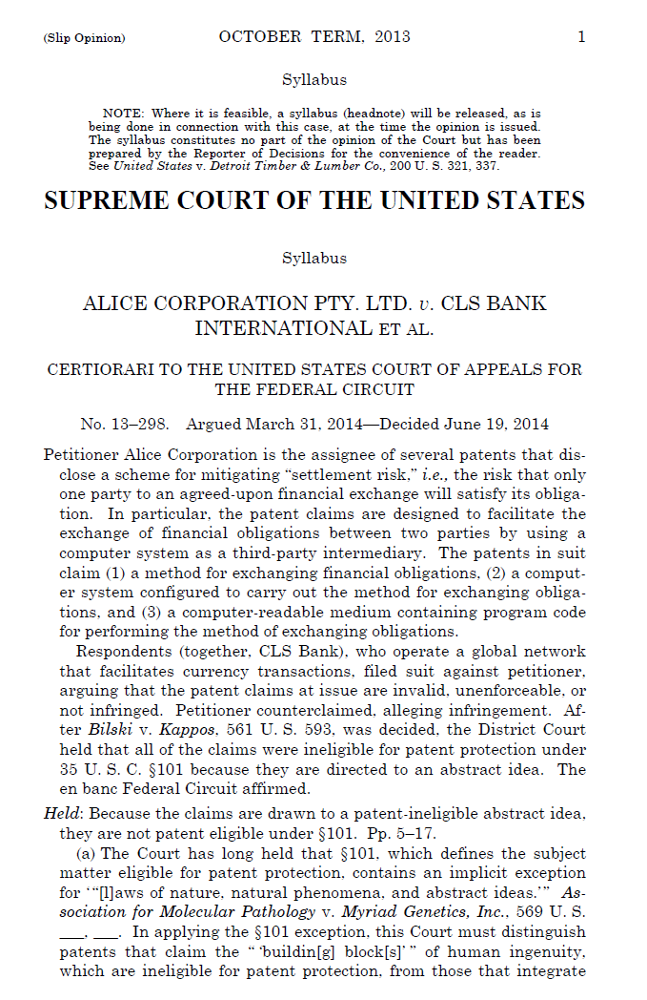
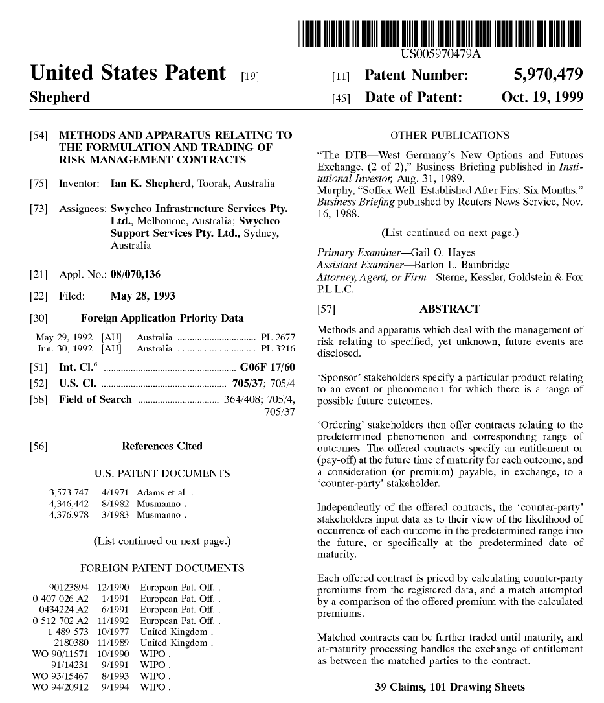
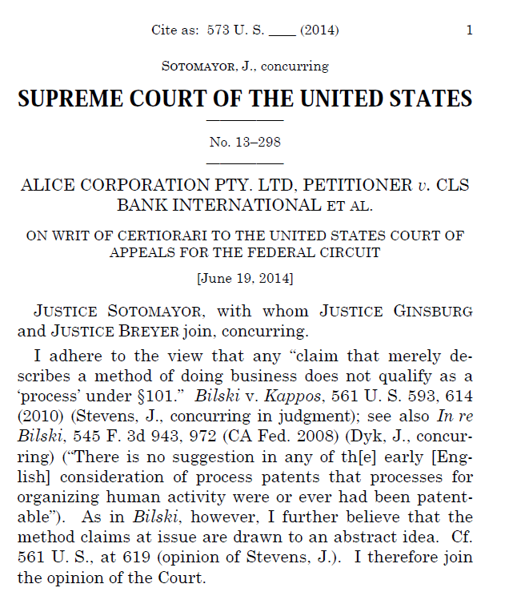

DRAFT --- ## Alice Corp. v. CLS Bank (573 U.S. 208, 2014)

### Case Metadata
- **Court:** U.S. Supreme Court
- **Citation:** 573 U.S. 208
- **Decision Date:** June 19, 2014
- **Issue:** Patent eligibility under 35 U.S.C. §101
- **Outcome:** Claims invalid under §101

> **Held:** Because the claims are drawn to a patent-ineligible abstract idea, they are not patent eligible under §101. *Alice Corp. v. CLS Bank Int’l*, 573 U.S. 208, 217 (2014).

**Primary Source:** [Supreme Court Slip Opinion (PDF)](case.pdf)

---

Alice Corp. v. CLS Bank is the foundational Supreme Court decision defining modern patent eligibility for software and computer-implemented inventions under 35 U.S.C. §101.

The case concerned patents directed to an intermediated settlement system implemented on generic computer infrastructure. The Supreme Court held that merely implementing an abstract financial concept on a computer does not transform the idea into patent-eligible subject matter.

The Court articulated the now-canonical two-step eligibility framework:

1. Determine whether the claims are directed to an abstract idea, law of nature, or natural phenomenon.  
2. If so, determine whether additional claim elements provide an “inventive concept” sufficient to transform the claim into patent-eligible subject matter.

Applying this test, the Court concluded that the asserted claims recited only an abstract idea implemented using conventional computer components and were therefore invalid under §101.

Alice has since become the primary doctrinal lens through which software, business-method, and many AI-related patent claims are evaluated, and it has significantly reshaped both patent prosecution strategy and litigation outcomes.

This folder collects the asserted patents, representative claims, and structured eligibility analysis to illustrate how the Court applied the two-step framework at the claim level in practice.

---

## Patent Family at Issue (Alice v. CLS Bank)

The litigation involved four related patents within a single continuation/continuation-in-part family. The Supreme Court treated Claim 33 of the ’479 patent as representative and applied its §101 analysis to all asserted claims across the family.

In plain terms, the ’479 patent is the parent patent, and the remaining patents are its child patents—later continuations or continuation-in-part filings that trace back to that same family lineage.

| Patent | Relationship (Immediate Parent) | Relationship (Family Lineage) | Filed | Issued |
|--------|--------------------------------|-------------------------------|-------|--------|
| US 5,970,479 | Parent | Root of asserted family | May 28, 1993 | Oct. 19, 1999 |
| US 6,912,510 | Continuation of earlier application; downstream of ’479 | Family member derived from ’479 via continuation/CIP chain | May 9, 2000 | Jun. 28, 2005 |
| US 7,149,720 | Continuation of ’510 application | Same family lineage back to ’479 | Dec. 31, 2002 | Dec. 12, 2006 |
| US 7,725,375 | Continuation of ’510 application | Same family lineage back to ’479 | Jun. 27, 2005 | May 25, 2010 |

Key point: invalidation of the representative claims effectively rendered the
entire patent family ineligible under §101.

---

### Purpose of this Analysis

Most discussions of Alice focus on the legal doctrine and two-step framework.  
This repository instead examines the asserted patent claims directly, mapping the Supreme Court’s reasoning to specific claim language to show **where and why the claims failed** under §101.

The goal is to treat eligibility as a claim-structure problem rather than an abstract legal principle, enabling more concrete guidance for drafting, evaluating, and stress-testing software and AI patents.

---

## Alice Corp (US 5,970,479)

<!-- Shows the Front Page of Patent Reduced Image Size -->

  

**Original USPTO front page showing inventors, assignee, filing dates, references, and abstract.*
**Primary source:** [Google Patents – US 5,970,479](https://patents.google.com/patent/US5970479A/en?oq=5970479)

---

## Patent Metadata

| Field | Value |
|-------|--------|
| **Patent Number** | US 5,970,479 |
| **Assignee** | Swychco Infrastructure Services Pty. Ltd. (Melbourne, AU); Swychco Support Services Pty. Ltd. (Sydney, AU) |
| **Inventor** | Ian K. Shepherd |
| **Filed** | May 28, 1993 |
| **Priority Date** | May 29, 1992 (Australia) |
| **Issued** | October 19, 1999 |
| **Claims** | 39 total |
| **Independent Claims** | 10 (Claims 1, 16, 18, 32, 33, 35, 36, 37, 38, 39) |
| **Drawing Sheets** | 101 |
| **US Class** | 705/37, 705/4 (financial/business methods) |
| **Status** | Expired (20-year statutory term) |
| **Title** | *Methods and apparatus relating to the formulation and trading of risk management contracts* |

This analysis focuses on the specific computational and transactional steps recited in the claims rather than the high-level ‘idea of trading risk,’ because patent eligibility and validity turn on the claimed technical implementation details, not the abstract financial concept.

---

### Representative Claim Selection

The Court treated Claim 33 of the ’479 patent as representative of all asserted claims.

Although most independent claims are drafted as computer systems or computer-implemented processes, Claim 33 removes nearly all computer or hardware language and recites the invention purely as a sequence of ledger-management steps.

By treating this stripped-down claim as “representative,” the Court analyzed the invention without the surrounding “computer” terminology. As a result, the substance of the claims appears as straightforward ledger bookkeeping rather than a technological improvement.

###  Independent Claim Overview (Structure of the Patent)

The table below shows the ten independent claims and highlights how nine rely on explicit computer/system architecture, while Claim 33 stands alone as a pure business method.

| Claim | Statutory Form | Drafting Style | Computer/System Language? | Notes |
|--------|----------------|----------------|----------------------------|-------|
| 1 | System (apparatus) | Computer-based data processing system | ✅ Yes | Input means, storage means, processing means |
| 16 | System (distributed) | Networked data processing devices | ✅ Yes | Multiple processors + communications links |
| 18 | Method | Computer-implemented method | ✅ Yes | Uses “data processing apparatus” |
| 32 | Method of making system | Configuring/programming a computer system | ✅ Yes | Hardware interconnections + programming steps |
| **33** | **Method** | **Pure business process** | ❌ **No** | **Shadow ledgers + balance updates + end-of-day settlement only** |
| 35 | System | Data processing system | ✅ Yes | Generic computing components |
| 36 | System | Pricing data processing system | ✅ Yes | Storage + processing means |
| 37 | System | Pricing/matching system | ✅ Yes | Generic computing structure |
| 38 | System | Componentized pricing system | ✅ Yes | Still generic computing |
| 39 | System | Repricing/matching system | ✅ Yes | Generic computing again |

**Observation:** Claim 33 is the only independent claim that omits any computer or system architecture language. The Supreme Court treated this stripped-down method as representative, exposing the invention’s core logic as ledger bookkeeping rather than a technological improvement.

---

###  Representative Claim Text (Claim 33)

33. A method of exchanging obligations as between parties, each party holding a credit record and a debit record with an exchange institution, the credit records and debit records for exchange of predetermined obligations, the method comprising the steps of:
(a) creating a shadow credit record and a shadow debit record for each stakeholder party to be held independently by a supervisory institution from the exchange institutions;
(b) obtaining from each exchange institution a start-of-day balance for each shadow credit record and shadow debit record;
(c) for every transaction resulting in an exchange obligation, the supervisory institution adjusting each respective party's shadow credit record or shadow debit record, allowing only these transactions that do not result in the value of the shadow debit record being less than the value of the shadow credit record at any time, each said adjustment taking place in chronological order; and
(d) at the end-of-day, the supervisory institution instructing ones of the exchange institutions to exchange credits or debits to the credit record and debit record of the respective parties in accordance with the adjustments of the said permitted transactions, the credits and debits being irrevocable, time invariant obligations placed on the exchange institutions.

## Simplified Version of Claim 33 (Plain-English Restatement)

To understand why Claim 33 fails under §101, it helps to restate it without patent drafting language.  
In practical terms, the claim describes routine clearinghouse bookkeeping:

**Claim 33 — Simplified**

1. Create temporary (“shadow”) ledger accounts for each party  
2. Copy each party’s starting balances  
3. For each transaction:
   - update balances  
   - reject if insufficient funds  
4. At day’s end, instruct the banks to settle the approved transactions

---

## §101 Eligibility Analysis

The Supreme Court evaluates patent eligibility using the two-step framework first articulated in *Mayo Collaborative Services v. Prometheus Laboratories, Inc.* and later applied to software and business-method claims in *Alice Corp. v. CLS Bank International*:

1. **Is the claim directed to an abstract idea, law of nature, or natural phenomenon?**  
2. **If so, does the claim include an “inventive concept” that transforms it into patent-eligible subject matter?**

Applying those questions to Claim 33 is straightforward.

---

### Step One — Abstract Idea

When reduced to its operational steps:

> Create temporary ledgers → copy balances → update transactions → prevent overdrafts → settle at day’s end

This is simply a clearinghouse bookkeeping process.

The claim recites only routine financial and accounting operations and does **not** describe any technological improvement, specialized architecture, or technical solution.

Consistent with *Bilski v. Kappos*, the Court characterized the focus of the claims as:

> “the abstract idea of intermediated settlement”

**Conclusion:** Claim 33 is directed to an abstract economic practice.

---

### Step Two — Inventive Concept

The remaining question is whether implementing this logic on a computer adds anything meaningfully technological.

It does not.

Examined individually, each step (recordkeeping, balance updates, and instructions) is routine and conventional.  
Considered as an ordered combination, the steps still amount only to bookkeeping performed on a generic computer.

The computer merely performs basic functions such as storing data, performing arithmetic, and issuing instructions. These are ordinary capabilities of any general-purpose computer and do not transform the abstract idea into a technological invention.

**Conclusion:** The claim lacks an inventive concept.

---

### Overall Result

- **Step One:** abstract economic practice  
- **Step Two:** no technological or inventive contribution  

Therefore, Claim 33 is not patent-eligible subject matter under §101.

Because the parties treated Claim 33 as representative and the remaining claims added only generic computer implementation, the Court’s reasoning applied equally to the other asserted claims. As a practical matter, the decision disposed of the asserted claims across the entire patent family.

---

## Final Note — Unanimous Supreme Court Decision

The decision in *Alice Corp. v. CLS Bank International* was unanimous.

Justice Thomas delivered the opinion for a nine-Justice Court.  
There was no dissent. The only concurrence (Justice Sotomayor, joined by Justices Ginsburg and Breyer) expressed an even more restrictive view that business-method claims may not be patentable at all.

The absence of disagreement underscores how straightforward the Court viewed the eligibility issue.

  

---

## References

- Justia summary: https://supreme.justia.com/cases/federal/us/573/208/  
- Background overview: https://en.wikipedia.org/wiki/Alice_Corp._v._CLS_Bank_International
- Discuss of case relevance: https://www.law.cornell.edu/supct/cert/13-298

---

## Author and Feedback

Prepared by **M. Joseph Tomlinson IV**, Registered U.S. Patent Agent (USPTO Reg. No. 83,522).

This repository reflects independent research, professional experience, and
educational analysis of software patents, claim structure, and related case law.
Portions were developed with the assistance of AI tools and refined through
human review and judgment.

Content is provided for **educational and informational purposes only** and does **not**
constitute legal advice. Patent validity and enforceability ultimately depend on
examination, licensing, and litigation outcomes.

Corrections, suggestions, or additional sources are welcome.  
Please open an issue or contact the author directly.

**Email:** mjtiv@udel.edu

