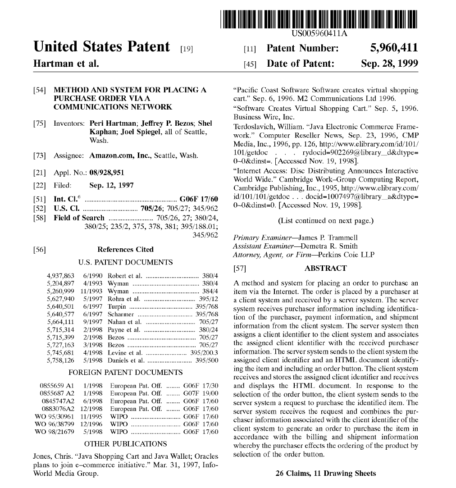
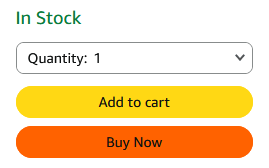
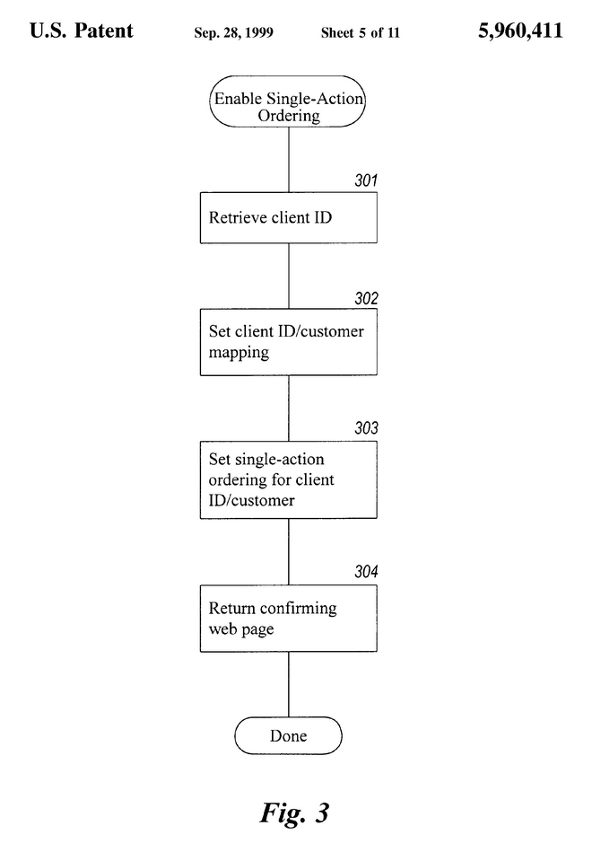
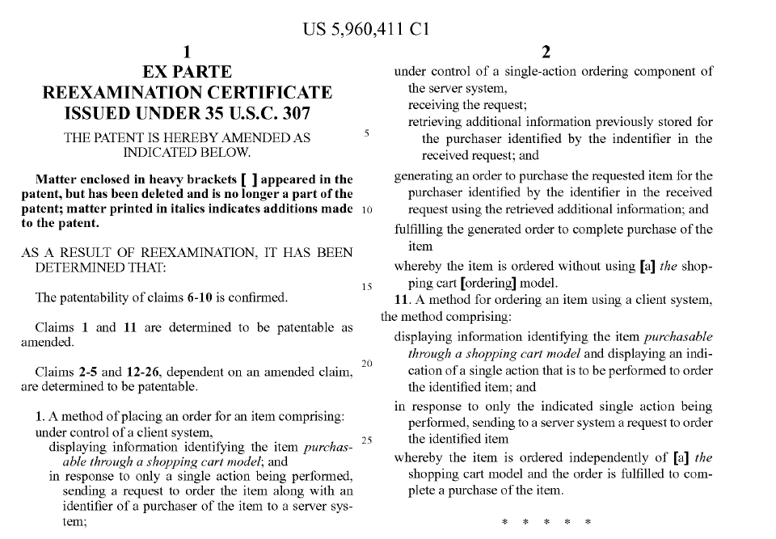

## Amazon “1-Click” Patent (US 5,960,411)

<!-- Shows the Front Page of Patent Reduced Image Size -->

  

*Original USPTO front page showing inventors, assignee, filing dates, references, and abstract.*
**Primary source:** [Google Patents – US 5,960,411](https://patents.google.com/patent/US5960411A)

This page provides a structured technical and legal analysis of Amazon’s 1-Click patent, examining the original claims, system architecture, and enforcement strategy. The goal is to understand how the patent was drafted, why it was historically effective, and how it would likely be evaluated under modern post-Alice §101 standards. This material is presented for educational and research purposes only and does not constitute legal advice. As with all patents, practical enforceability and real-world significance are ultimately determined through examination, licensing, and litigation rather than the written claims alone.

---

## Patent Metadata

| Field | Value |
|-------|--------|
| **Patent Number** | US 5,960,411 |
| **Assignee** | Amazon.com, Inc. |
| **Inventors** | Peri Hartman, Jeffrey P. Bezos, Shel Kaphan, Joel Spiegel |
| **Filed** | September 12, 1997 |
| **Issued** | September 28, 1999 |
| **Claims** | 26 total |
| **Independent Claims** | 4 (Claims 1, 6, 9, 11) |
| **Drawing Sheets** | 11 |
| **Status** | Expired (2017) |
| **Title** | *Method and system for placing a purchase order via a communications network* |

---

## Real-World Implementation

Amazon exposed the patented behavior through a **single-action purchase button**,
allowing customers to bypass the shopping cart and checkout process entirely.
This UI maps directly onto the client → server → stored-data architecture described
in Claim 1.

---

## Timeline / Historical Context

- **1997 — Patent filed**
- **1999 — Patent issued**
- **2000 — Dot-com bubble peak** *(macro context)*
- **2000 — Apple licenses 1-Click**
- **2001 — Dot-com crash** *(macro context)*
- **2002 — Litigation vs Barnes & Noble** — settlement
- **2010 — USPTO reexamination concludes** — claims narrowed
- **2011 — European Patent Office review** — EP counterpart rejected
- **2014 — Alice v. CLS Bank** — §101 eligibility tightened for software patents
- **2017 — Patent expired**

---

**Big picture:**  
This patent derived most of its value during a **pre-Alice era**, when software eligibility standards were more permissive and ecommerce competition was rapidly forming. Major enforcement and licensing occurred years before modern §101 doctrine took hold.

### References

- Apple license coverage — https://web.archive.org/web/20110616040418/http://news.cnet.com/2100-1017-245879.html  
- Barnes & Noble litigation opinion — https://law.justia.com/cases/federal/appellate-courts/F3/239/1343/636084/  
- EPO rejection summary — https://www.pcworld.com/article/487010/article-1139.html  
- General background — https://en.wikipedia.org/wiki/1-Click

---

### Common Name
Often referred to as the **“1-Click ordering” patent**.

### Core Concept (High Level)

A stateful client–server purchasing architecture that:

1. Stores purchaser identity, payment, and shipping information,
2. Recognizes returning users,
3. Enables ordering through a **single user action**, and
4. Automatically completes checkout **without a traditional shopping cart workflow**.

The invention shifts transaction complexity from the user to the backend by relying on
previously stored customer state.

### Patent Figure — System Flow (Fig. 3)

  

*Figure 3 from the issued patent.  
This diagram captures the end-to-end “single-action ordering” pipeline that underlies Claim 1.  
Across many patents (not just software), the first high-level figure often reflects the core inventive concept and provides a helpful roadmap when interpreting the claims.*

### Practical Significance

- Early and influential **e-commerce / software patent**
- Successfully asserted in litigation and licensing during the dot-com era
- Illustrates broad **pre-Alice §101 eligibility standards**
- Later **narrowed through USPTO reexamination**, demonstrating post-grant risk and claim scope contraction

### How to Study This Patent

For technical or legal analysis:

- Start with the **original 1999 issued claims** (litigation posture)
- Compare against the **reexamination certificate** (scope reduction)
- Map the claims to the **client → server → stored-data** architecture shown above

This patent is commonly used as a reference example for:

- software/business-method claim drafting
- client/server system claims
- patent lifecycle (issue → enforcement → reexam → expiration)
- historical pre- vs post-Alice eligibility contrasts

---

## Claim Architecture — Four Independent Claims

A common misconception is that Amazon’s “1-Click” patent protects only a UI button.  
In reality, it was drafted as a **full-stack claim set** covering the entire:

client → server → stored state → automatic fulfillment pipeline

By spreading protection across multiple statutory classes, the patent enables enforcement
at different technical layers and makes simple design-arounds difficult.

**In plain terms:** each independent claim captures a different piece of the “1-Click” system
(the process, the frontend, and the backend), so competitors could not avoid infringement
simply by moving the logic around or redesigning one component.

---

### System Roles (Terminology)

- **Client** — user device/app that displays items and sends the order request  
- **Server** — backend that retrieves stored data and processes the order  
- **Database** — persistent customer state (identity, payment, shipping)

**Pipeline:**  
User Action → Client → Server → Stored Data → Fulfillment

---

### Independent Claims (at a glance)

| Claim | Type | Covers | Enforcement Target |
|--------|-----------|-------------------------------|---------------------------|
| 1 | Method | End-to-end transaction flow | Anyone performing process |
| 6 | Client system | Frontend/device logic | Apps, browsers, devices |
| 9 | Server system | Backend/order infrastructure | Retailers/platforms |
| 11 | Method | Simplified ordering flow (fewer structural limits) | Alternate / fallback infringement path |

> **Note:** Readers are strongly encouraged to review all four independent claims together.  
> The claims are intentionally interwoven, with overlapping features distributed across
> method, client, and server forms to prevent design-arounds.  
> For clarity and depth, the detailed walkthrough below focuses primarily on **Claim 1**,  
> as it captures the complete end-to-end transaction flow and is the easiest to map architecturally.

---

### Structural Strategy (Why this is clever)

This creates **vertical stack coverage**:

- Change UI → server claim still applies  
- Change backend → method claim still applies  
- Split responsibilities → apparatus claims still apply  

In short, the patent protects **behavior + frontend + backend simultaneously**,  
which explains its historical enforcement strength.

---

## Examining Original Claim 1 (Verbatim)

> **1. A method of placing an order for an item comprising:**
>
> under control of a client system,  
> displaying information identifying the item; and  
> in response to only a single action being performed, sending a request to order the item along with an identifier of a purchaser of the item to a server system;  
>
> under control of a single-action ordering component of the server system,  
> receiving the request;  
> retrieving additional information previously stored for the purchaser identified by the identifier in the received request; and  
> generating an order to purchase the requested item for the purchaser identified by the identifier in the received request using the retrieved additional information; and  
> fulfilling the generated order to complete purchase of the item  
>
> whereby the item is ordered without using a shopping cart ordering model.

---

## Claim 1 — Method (Chunked by Execution Flow)

**Type:** Method  
**Scope:** End-to-end ordering pipeline (frontend → backend → fulfillment)

This claim can be understood more clearly by grouping the steps by **system responsibility** rather than legal sentence structure.

### Phase 1 — Client (Frontend)
**Summary:** User initiates the order with a single action.

Under control of a client system:

- display information identifying the item  
- in response to **only one action**:
  - send a request to order the item  
  - include a purchaser identifier  
  - transmit the request to the server  

👉 *Effect:* One-click trigger replaces multi-step checkout.

### Phase 2 — Server (Backend)
**Summary:** Server completes the transaction automatically using stored state.

Under control of a single-action ordering component:

- receive the request  
- retrieve previously stored purchaser information  
- generate the order using the stored information  
- fulfill the generated order  

👉 *Effect:* No additional user input required.

### Result — Functional Outcome
**Summary:** Checkout workflow is eliminated.

- the item is ordered **without using a shopping cart model**

👉 *Effect:* Direct purchase instead of traditional cart → checkout → payment flow.

## Architectural Interpretation

The claim describes a simple but stateful transaction pipeline:

User action  
→ Client sends request + purchaser ID  
→ Server retrieves stored customer data  
→ Order generated automatically  
→ Fulfillment completed

Viewed this way, Claim 1 protects a **stateful client–server transaction architecture**,  
not merely a UI button or isolated frontend feature.

---

### Reexamination Impact (Claims 1 and 11)

During USPTO **ex parte reexamination**, the broadest method claims were amended to add the phrase:

> “purchasable through a shopping cart model”

This amendment **materially narrowed the scope**.

Originally, the claims covered essentially any single-action ordering flow.  
After amendment, infringement requires a system that:

1. supports a traditional shopping cart workflow, and  
2. provides a separate single-action path that bypasses that cart.

In practical terms, the patent no longer covers all “one-click” purchasing systems — only those layered on top of an existing shopping-cart architecture.

This significantly reduces the universe of potential infringement.

### Legal Timing

The **reexamination certificate issued in March 2010**, which is the legally operative date when the amended (narrowed) claims took effect.

*Note:* USPTO reexamination certificates typically do **not** display a clear issue date on the first page, so timing is confirmed through PTO records and contemporaneous reporting.

### Reexamination Certificate (Claims Amended)

  

*Excerpt from the USPTO ex parte reexamination certificate showing the added  
“purchasable through a shopping cart model” limitation to Claims 1 and 11.*

### Source

- Amazon’s 1-Click patent confirmed following re-exam (Mar 2010)  
  https://www.bizjournals.com/seattle/blog/techflash/2010/03/amazons_1-click_patent_confirmed_following_re-exam.html

---

## Historical Note

Although Amazon’s **1-Click ordering patent (US 5,960,411)** is often described as a “gold standard”
or iconic software patent, a modern legal analysis suggests that its historical strength was largely
a product of **timing rather than doctrinal robustness**.

Two independent signals support this conclusion.

---

### 1. Post-Alice §101 analysis (United States)

Under the framework established in *:contentReference[oaicite:0]{index=0}*, 573 U.S. 208 (2014), courts ask:

1. Is the claim directed to an abstract idea (e.g., a fundamental business or commercial practice)?  
2. If so, does it add significantly more than generic computer implementation?

Claim 1 of the 1-Click patent primarily describes:

- displaying an item  
- performing a single action  
- sending an order request using stored customer information  
- automatically completing the purchase  

In a post-Alice environment, this would likely be characterized as:

> “ordering goods using stored customer data implemented on generic client/server systems”

Modern courts frequently characterize such claims as an **abstract commercial practice**
rather than a technical improvement to computer functionality. As a result, the claim would
face substantial risk of invalidity under §101 today.

### 2. European Patent Office outcome

The corresponding application filed with the European Patent Office (EPO) was rejected for **obviousness**, and the rejection was later upheld.

This provides an independent, non-U.S. confirmation that the invention was viewed as:

- an incremental automation of an existing commercial process,  
- rather than a sufficiently technical or non-obvious engineering advance.

### Practical takeaway

Historically, the patent was extremely valuable:

- enforced early  
- licensed commercially  
- and influential in shaping early e-commerce user experience  

However, its success appears tied to:

- pre-Alice U.S. eligibility standards, and  
- favorable early market timing  

rather than claims that would likely survive modern §101 scrutiny.

Accordingly, the Amazon 1-Click patent is best understood as a **historically important and strategically effective patent**,  
but **not a reliable template for post-Alice software patent drafting or survivability analysis**.

### References

- Alice case summary (Justia):  
  https://supreme.justia.com/cases/federal/us/573/208/

- *EPO rejects Amazon One-Click patent for obviousness* (PCWorld, 2011):  
  https://www.pcworld.com/article/487010/article-1139.html

---

## Author and Feedback

Prepared by **M. Joseph Tomlinson IV**, Registered U.S. Patent Agent (USPTO Reg. No. 83,522).

This repository reflects independent research, professional experience, and
educational analysis of software patents, claim structure, and related case law.
Portions were developed with the assistance of AI tools and refined through
human review and judgment.

Content is provided for **educational and informational purposes only** and does **not**
constitute legal advice. Patent validity and enforceability ultimately depend on
examination, licensing, and litigation outcomes.

Corrections, suggestions, or additional sources are welcome.  
Please open an issue or contact the author directly.

**Email:** mjtiv@udel.edu

