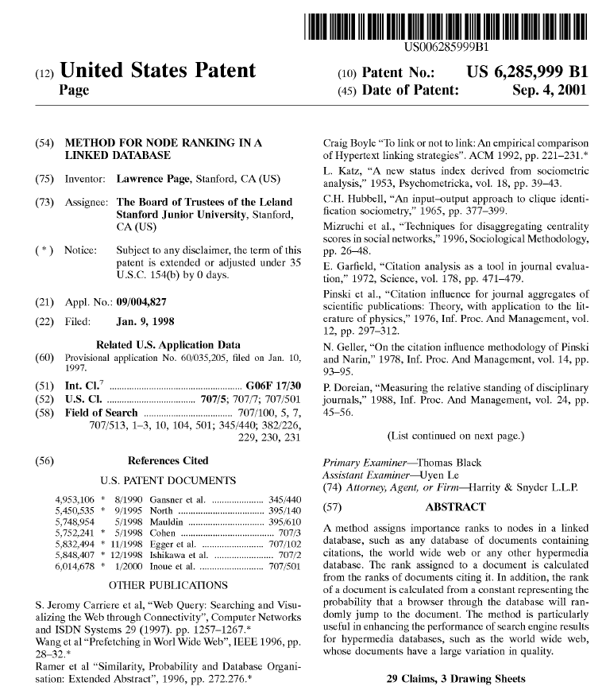
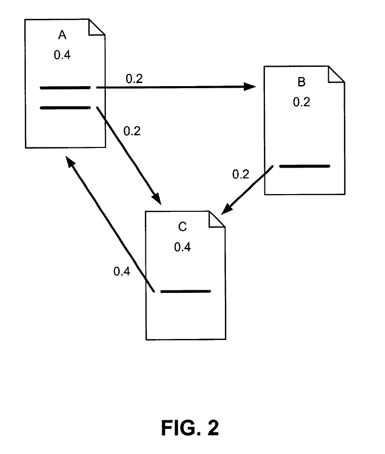

## Google’s PageRank Patent (US 6,285,999)

<!-- Shows the Front Page of Patent Reduced Image Size -->

  

**Original USPTO front page showing inventors, assignee, filing dates, references, and abstract.*
**Primary source:** [Google Patents – US 6,285,999](https://patents.google.com/patent/US6285999B1/en?oq=6285999)

This page provides a structured technical and legal analysis of Google’s PageRank patent (US 6,285,999), examining the independent claims, algorithmic structure, and computational architecture underlying the ranking method. The goal is to understand how the patent was drafted, why the invention represented a non-obvious application of graph-based computation to a linked database, and how it would likely be evaluated under modern post-Alice §101 eligibility standards and traditional §103 obviousness analysis. This material is presented for educational and research purposes only and does not constitute legal advice. As with all patents, practical enforceability and real-world significance are ultimately determined through examination, licensing, and litigation rather than the written claims alone.

---

## Patent Metadata

| Field | Value |
|-------|--------|
| **Patent Number** | US 6,285,999 B1 |
| **Assignee** | The Board of Trustees of the Leland Stanford Junior University (licensed exclusively to Google) |
| **Inventor** | Lawrence Page |
| **Filed** | January 9, 1998 |
| **Issued** | September 4, 2001 |
| **Claims** | 29 total |
| **Independent Claims** | 6 (Claims 1, 8, 9, 10, 18, 19) |
| **Drawing Sheets** | 3 |
| **Status** | Expired (term ended ~2018–2019) |
| **Title** | *Method for node ranking in a linked database* |

This analysis focuses on the specific computational steps recited in the claims rather than the high-level ‘idea of ranking,’ because patent eligibility and validity turn on the claimed implementation details, not the conceptual goal.

---

## 1) Overview 

This document analyzes U.S. Patent No. 6,285,999 B1, often referred to as the PageRank patent, originally assigned to Stanford University and exclusively licensed to Google. The patent claims computer-implemented methods for ranking nodes in a linked database by computing importance scores derived from the global structure of hyperlink connections between documents.

Unlike earlier search systems that relied primarily on keyword frequency and metadata, the claimed technique iteratively propagates and redistributes link-based weights across the graph to produce rankings that reflect aggregate endorsement within the network.

This review focuses on independent Claim 1 and related independent claims (Claims 8–10), evaluated under modern patent standards including §101 (eligibility) and §103 (obviousness). The analysis emphasizes the specific computational steps recited in the claims and the overall inventive concept, because patent validity turns on the claimed implementation rather than the abstract idea of “ranking.” Detailed mathematical treatment of the PageRank algorithm is available in the patent specification and other technical references and is discussed here only as necessary to understand the claim structure.

### Historical Significance

US 6,285,999 is widely regarded as one of the foundational software patents of the early web era. The claimed ranking method became central to Google’s search engine architecture and influenced the broader evolution of link-based information retrieval systems.

---

## 2) Technical Background

The PageRank invention operates on a linked database — effectively a directed graph in which nodes represent documents (e.g., web pages) and edges represent hyperlinks between them.

### Core Concept

At a high level, the patented algorithm:

1. Processes a set of nodes in a linked database  
2. Examines the link relationships between nodes  
3. Assigns initial numeric scores (importance values)  
4. Iteratively recomputes each node’s score based on the structure and weight of inbound links  
5. Continues iteration until the scores converge to a stable distribution  

The process relies on two interdependent principles:

- **Recursive scoring:** A node’s importance depends on the importance of the nodes that link to it  
- **Convergence:** The computation repeats until the scores stabilize, producing a fixed-point solution over the link graph  

> **Intuition.** The process can be compared to scoring U.S. cities based on the number and quality of highways connecting them. Cities served by many major interstates become more important, and that importance propagates outward to the cities they connect to. Repeating this redistribution eventually yields a stable ranking that reflects each city’s overall centrality within the network.

### Patent Figure — Example Link Graph (Fig. 2)

  

Figure 2. Simplified three-document link graph illustrating recursive rank propagation. Each node distributes its score across outbound links, and repeated redistribution converges to a stable importance distribution (A = 0.4, B = 0.2, C = 0.4). </em>

### Why This Was Novel

At the time of invention (late 1997–early 1998):

- Search engines primarily relied on local signals such as keyword frequency and document metadata  
- These signals were easily manipulated (e.g., keyword stuffing or artificially modifying metadata)  
- Treating the hyperlink structure of the web as a quantitative ranking signal was uncommon  
- Applying recursive propagation across very large linked datasets at web scale was not standard practice  

As a result, earlier ranking methods were susceptible to spam and gaming. A page could artificially inflate its apparent relevance simply by repeating keywords or altering metadata, without any meaningful external validation.

Some prior systems had begun incorporating hyperlink information. For example, the “Hyperlink Search Engine” described in the patent used backlinks (incoming links from other pages) and anchor text to characterize a page’s relevance. However, those approaches treated links primarily as local descriptive features — effectively a single-hop signal — and did not recursively propagate importance across the entire network.

PageRank extended this idea from local backlink evidence to a global graph-based computation. Each document functioned both as a linking and linked node, allowing importance to flow through the network iteratively until a stable ranking emerged. In effect, influence was determined not merely by how many pages linked to a document, but by how important those linking pages were, and so on recursively.

> **Intuition.** Earlier systems were similar to counting how many highways enter a city and stopping there. PageRank instead models the entire country at once: every city both sends and receives traffic, and importance is redistributed repeatedly across the full highway network until the rankings stabilize. This requires considering the whole map simultaneously rather than evaluating each city in isolation.

In practical terms, this meant building a large-scale representation of the web’s link graph and performing iterative computations across millions of pages — a significantly more demanding computational task than simple backlink or keyword counting.

Thus, the inventive contribution is not simply “ranking,” but using the linked database structure as a computational signal to produce a global importance ordering that is more resistant to manipulation and cannot be derived from isolated document features alone. (As later history showed, even this mechanism required further evolution as link-based systems themselves became targets for gaming.)

From a patent perspective, these characteristics also support non-obviousness under §103, as the prior art did not teach or suggest applying recursive, graph-wide propagation to hyperlink structures at web scale.

---

## 3) Claim Structure (High-Level)

This patent uses multiple independent claim formats to cover the same core ranking concept from different legal angles: **method claims** and **computer-readable medium (CRM) claims**.  
Notably, the patent does **not** include system/apparatus claims.

### Independent Method Claims (n = 4)

| Claim | Framing Style | Key Idea |
|--------|--------------|-----------|
| **Claim 1** | Broad graph structure | Documents act as both linking + linked; scores derived from linking documents; process by scores |
| **Claim 8** | Per-document | Select one document; score depends on scores of linking docs |
| **Claim 9** | Iterative/estimation | Initial rank estimate + repeated updating (explicit iteration language) |
| **Claim 10** | Random traversal | Random-surfer style; rank based on visit frequency |

These represent **four alternative independent ways** to claim the same ranking/scoring mechanism.

### Independent Computer-Readable Medium (CRM) Claims (n = 2)

| Claim | Type | Purpose |
|----------|-----------|-----------|
| **Claim 18** | CRM (Beauregard) | Instructions that execute the Claim 1–style scoring method |
| **Claim 19** | CRM (Beauregard) | Instructions that score and provide documents based on ranks |

These claims protect the **software artifact itself** (stored instructions), not just the act of performing the method.

### Observations
This claim structure reflects early-2000s software patent practice, where applicants commonly paired method claims with CRM claims to ensure protection for both execution and distribution of software, sometimes without separate system claims.

- Covers **methods** → performing the ranking  
- Covers **CRM** → distributing/executing the software  
- **No system/apparatus claims**  
- Demonstrates early-era software patent strategy (method + CRM pairing)

### Claim Strategy Note

Interestingly, the patent includes independent method and computer-readable medium (CRM) claims but no separate system/apparatus claims.

For an algorithmic invention like PageRank, this may be intentional. Method and CRM claims protect the computational process and the software itself without tying the invention to any specific hardware configuration. In rapidly evolving technical fields, system claims that recite particular architectures (e.g., servers, nodes, or specialized hardware) can inadvertently narrow scope as implementations change over time.

As a result, the method + CRM pairing provides hardware-agnostic coverage that remains adaptable as computing platforms evolve that has aged well as computing platforms evolved from early web servers to modern distributed and cloud-based systems.

---

## 4) Claim 1 — Element-by-Element Analysis

### Claim Text

> **Claim 1.** A computer implemented method of scoring a plurality of linked documents, comprising:  
> obtaining a plurality of documents, at least some of the documents being linked documents, at least some of the documents being linking documents, and at least some of the documents being both linked documents and linking documents, each of the linked documents being pointed to by a link in one or more of the linking documents;  
> assigning a score to each of the linked documents based on scores of the one or more linking documents; and  
> processing the linked documents according to their scores.

### Element Breakdown

| # | Claim Language | Plain Meaning | Technical Role | Legal Purpose |
|---|---------------|--------------|----------------|--------------|
| Preamble | A computer implemented method... | Software process for ranking documents | Method framing | §101 tie to computer implementation |
| 1 | obtaining a plurality of documents | Collect pages | Input dataset | Defines scope |
| 2–5 | linked / linking / both / pointed to by a link | Documents form a directed graph | Graph structure | Enables recursive scoring |
| 6 | assigning a score ... based on scores of linking documents | Score depends on scores of others | Recursive dependency | Core inventive concept |
| 7 | processing ... according to their scores | Use the ranking | Output stage | Practical application (not abstract math) |

---

## 5) §101 Eligibility Considerations

A modern §101 analysis asks:
- Does the claim merely recite an abstract idea?
- Or does it claim a concrete technological improvement in computer functionality?

### Arguments supporting eligibility

- The invention cannot practically be performed mentally; it requires iterative, large-scale computation over massive linked datasets.
- The claims recite a specific scoring technique applied to a particular data structure (a linked document graph), not a disembodied mathematical formula.
- The method addresses a technical computer-science problem — ranking nodes in a web graph — rather than merely “organizing information.”
- The implementation improves search engine operation and resource allocation, suggesting a concrete technological application.

Modern courts often look for:
> “a specific technological solution to a problem in computer science.”
Under this framing, PageRank can be characterized as a technical improvement to search-engine functionality rather than an abstract idea.

### Contrast: Hypothetical Overbroad Version (Likely §101 Risk)

Consider a much broader formulation:
> *A method of ranking documents based on relationships between documents.*

This formulation omits:
- the linked database structure  
- recursive score dependency  
- iterative convergence  
- any concrete computational mechanism  

Such language would likely be characterized as the abstract idea of “ranking information” or “organizing content,” which modern courts routinely treat as ineligible under §101.
By contrast, Claim 1 ties the ranking process to:
- a specific graph-based data structure,
- defined computational steps,
- iterative numerical propagation,
- and a concrete technical application.

These limitations anchor the claim to a computer-implemented improvement rather than a disembodied concept.

### Note on contrary views

Not all commentators agree that such claims are clearly safe under §101.  
In an earlier discussion, **John F. Duffy** argued that broad eligibility restrictions could place core software innovations — including Google’s ranking methods — at risk of ineligibility. His analysis highlights how purely computational methods that manipulate information without physical transformation may be vulnerable under stricter interpretations of §101.

For a detailed historical and doctrinal discussion, see:

John F. Duffy, *The Death of Google’s Patents?*  
https://patentlyo.com/media/docs/2008/07/googlepatents101.pdf

---

## 6) Summary & Takeaways

PageRank’s real invention was not “search” but ranking via recursive link-based propagation.
The claim structure reflects this by emphasizing computation steps applied to a linked database.
Modern §101 philosophy would likely treat this as a technical improvement, not an abstract idea.
Novelty is tied to the specific application of graph theory to the web’s hyperlink structure — not just to ranking itself.
Drafting is focused and avoids overuse of system boilerplate or unnecessary hardware language.

---

## 7) References
https://patents.google.com/patent/US6285999B1/en?oq=6285999
https://en.wikipedia.org/wiki/PageRank

---

## 8) Author and Feedback

Prepared by **M. Joseph Tomlinson IV**, Registered U.S. Patent Agent (USPTO Reg. No. 83,522).

This repository reflects independent research, professional experience, and
educational analysis of software patents, claim structure, and related case law.
Portions were developed with the assistance of AI tools and refined through
human review and judgment.

Content is provided for **educational and informational purposes only** and does **not**
constitute legal advice. Patent validity and enforceability ultimately depend on
examination, licensing, and litigation outcomes.

Corrections, suggestions, or additional sources are welcome.  
Please open an issue or contact the author directly.

**Email:** mjtiv@udel.edu

